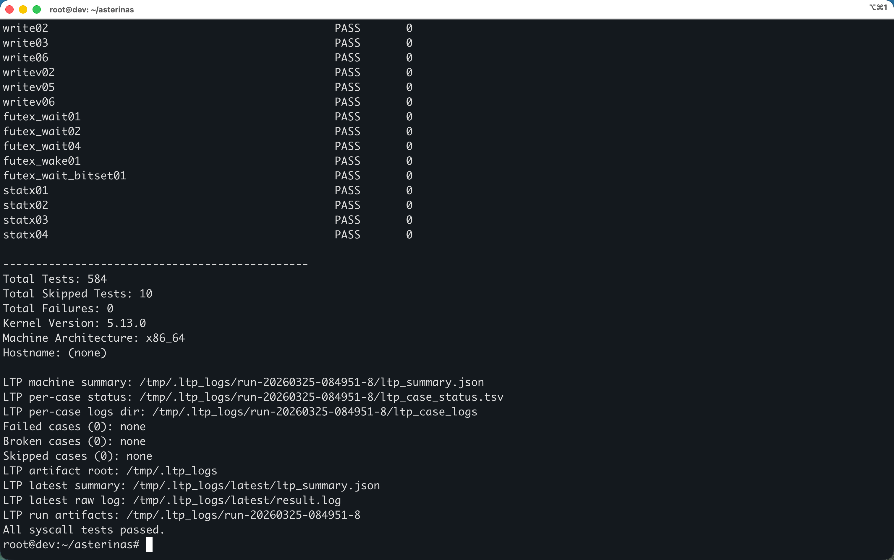

# LTP testcase Agentic Debugging and Development

围绕 LTP syscall 失败的测试用例，利用 Agent 来定位、修复 LTP 测试用例，最终产出是一组可复现的补丁、任务/实验记录和归因文档，用来持续扩大 `/tmp` 场景下的 Linux 兼容性覆盖，并把 `/ext2`、`/exfat` 的差异明确沉淀为 blocker 或后续任务。

## 解决的问题

LTP 测试覆盖率

## 如何利用 Agents

VSCode + Codex

- [Session 0](./artifacts/SESSION_0.md) 阅读整体项目代码，梳理LTP的测试流程，整理调试和开发的计划。
- [Session 1](./artifacts/SESSION_1.md) 主 Agent 负责阅读仓库、维护 Priority A todolist、安排下一批 testcase、整合结论。
  - 要求为每个子任务启动独立 subagent 调试开发。
  - 每完成一个 testcase，要求 subagent 完成三件事：修改代码并通过测试、写 debug 文档、提交 commit。

## 修复概览

- `97` 个补丁归档。
- `109` 个从 `all.txt` 中净启用的 LTP testcase。
- 额外 debug 文档，用于后续复现、归因和review。

LTP 的启用集大约从 `475` 个增长到当前的 `584` 个，重点推进了：

- 文件描述符与事件：`epoll*`、`fcntl*`。
- 调度与信号：`sched*`、`rt_sigqueueinfo*`、`rt_tgsigqueueinfo*`、`sigwait*`、`sigaction01`、`sighold02`。
- VFS 与路径语义：`open*`、`openat*`、`rename*`、`renameat2`、`link*`、`statx01`、`statx04`。

